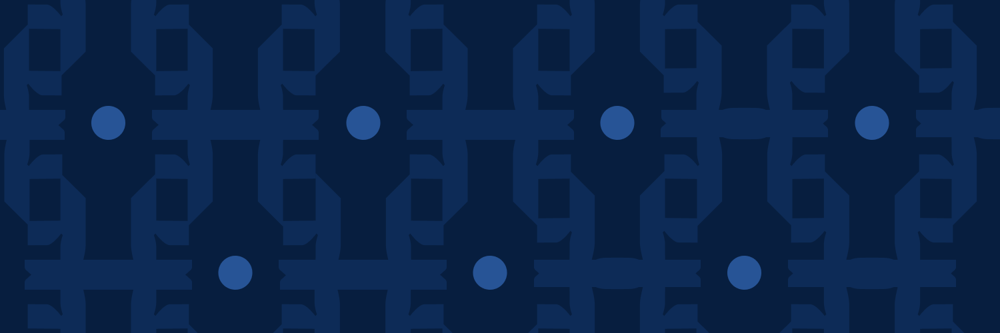
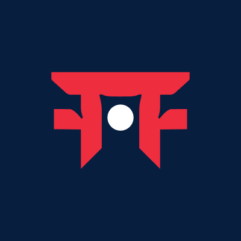

<picture>
  <source media="(prefers-color-scheme: dark)" srcset="assets/icon.png">
  
</picture>

[](https://discord.com/invite/dojoengine)
[](https://x.com/sudo_okhai)

# Survivor Exchange

**Survivor Exchange** is a fully on-chain auction and rental marketplace for BEAST NFTs from [Loot Survivor](https://docs.provable.games/lootsurvivor/beasts), built on Starknet with the [Dojo](https://dojoengine.org) framework. It solves key pain points in BEAST secondary trading:

- **Bulk Auctions**: Sell curated collections (e.g., 75 Shiny BEASTs, tier bundles like 10 T1s + Rank 1 Dragon).
- **English-Style Bidding**: Timed auctions with reserves, increments, and auto-settlement.
- **Rentals**: Short-term leases with fees/collateral (e.g., WBTC), enabling "try-before-buy" for gameplay.
- **Secure Vaults**: Custody for bids/NFTs.
- **Admin Controls**: Whitelisting, fees, pauses.

100% provable on-chain, with payments in SURVIVOR/LORDS/STRK. Reduces OTC friction, boosts liquidity, and captures fees for the Survivor DAO.

See full specs:
- [Product Requirements (PRD)](docs/PRD.md)
- [DAO Proposal](docs/DAO_PROPOSAL.md)
- [Developer Notes](docs/NOTES.md)

## 🛠 Quickstart (Local Dev)

### Prerequisites
- Rust & [Scarb](https://docs.scarb.rs/)
- Dojo CLI: `cargo install --git https://github.com/dojoengine/dojo sozo`
- [Katana](https://github.com/dojoengine/katana): `cargo install --git https://github.com/dojoengine/katana katana --bin katana`
- Docker (optional)

### 1. Start Katana (Terminal 1)
```bash
katana --dev
```
Note the RPC URL (default: `http://127.0.0.1:5050`).

### 2. Build, Migrate & Torii (Terminal 2)
```bash
sozo build
sozo migrate  # Copy the WORLD_ADDRESS
sozo torii start --world <WORLD_ADDRESS>
```
- World Explorer: `http://127.0.0.1:4040/graphql`
- Test contracts via Starknet explorer or scripts.

### Docker Compose (All-in-One)
```bash
docker compose up
```

## 📐 Architecture

```
survivor_exchange/
├── Scarb.toml              # Dojo 1.8.0, OpenZeppelin
├── src/
│   ├── lib.cairo           # Exports
│   ├── store.cairo         # Model readers/writers, events
│   ├── constants.cairo     # Errors, NS="bm_0_0_7"
│   ├── models/             # Auction, Bid, Rental, Vault, ExchangeSettings
│   ├── systems/            # admin, auction, rental, vault
│   ├── components/         # auctionable.cairo (rentable WIP)
│   ├── events/             # auction, bid
│   └── tests/              # test_world.cairo
├── docs/                   # PRD, Proposal, Notes
├── assets/                 # cover.png, icon.png
├── dojo_*.toml             # Dev/Release configs
└── compose.yaml            # Docker stack
```

**Key Components**:
- **Models**: `Auction` (status, seller, items), `Bid`, `Rental`, `VaultShare`.
- **Systems**: Execute logic (e.g., `auction.create`, `bid.place` with validations).
- **Store**: Centralized accessors for Dojo world storage.

## 🧪 Testing
```bash
sozo test
```
Coverage includes world setup, auction flows (`src/tests/test_world.cairo`).

## 🚀 Deployment
1. Update `dojo_release.toml` with mainnet RPC.
2. `sozo build && sozo migrate --network=mainnet`
3. Run Torii for indexing.
4. Frontend: Invite-only site planned (React + Torii GraphQL).

## 🗺 Roadmap
From PRD, Notes, & DAO Proposal:
1. **MVP (Current)**: Core auctions/rentals, bundles.
2. **Phase 2**: Whitelisting, LORDS/SURVIVOR payments, vaults for custody.
3. **Phase 3**: Lending integration (e.g., uncap), frontend launch, Shiny BEAST auction (75 units @ 50k SURVIVOR reserve).
4. **Future**: Achievements, metadata fetching, flash sales (1hr), DAO fees (1-2%).

## 🤝 Contributing
1. Fork/clone: `git clone <repo> && cd survivor_exchange`
2. Install deps: `scarb build`
3. Test: `sozo test`
4. Add feature → `sozo build && sozo test`
5. PR with description/tests.

Issues/Bugs: Discord (`tony.stark`) or open an issue.

## 📄 License
[MIT](LICENSE)

Built by [@sudo_okhai](https://x.com/sudo_okhai). Funded by Survivor DAO. Happy trading! 🦖
```
